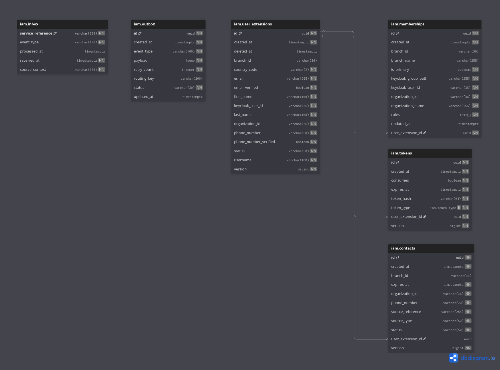

# eBikes Africa — IAM Service

> Manages identity, access, and user lifecycle for the eBikes Africa platform — from user provisioning and membership
> management through to verification, token handling, and outbox event reliability.

---

## Overview

The IAM service is the authoritative identity and access layer for the eBikes Africa platform. It governs the full
lifecycle of a user — from signup and provisioning through email and phone verification, password management, membership
assignment, and soft deletion. Upstream services trigger provisioning flows directly via REST; this service owns what
happens next.

Access control is organisation and branch-aware by design: the same pipeline handles system administrators, organisation
administrators, and branch-level users through a role-scoped membership model, each enforced via RBAC utilities at the
point of user creation and context switching. Keycloak is the identity provider; this service maintains a local
`UserExtension` record as the authoritative application-layer user state. An outbox pattern ensures audit events are
reliably published downstream even under partial failure.

**Owns:**

- User provisioning and signup (Keycloak + local extension record)
- Email and phone verification, account activation, and password reset
- Organisation and branch membership management
- Role-based access control and user creation authorisation
- Context switching (active organisation and branch per user session)
- Token generation, validation, and consumption
- Contact ingestion, resolution, and expiry
- Outbox event log and retry management
- Audit event publishing for all state transitions

**Does not own:**

- Organisation creation and structure — belongs to Organisation service
- Notification template management and dispatch — belongs to Notifications service
- Assignment and routing logic — belongs to Assignment service
- Payment processing — belongs to Payment & Billing
- Keycloak realm and client configuration — managed via infrastructure

---

## Platform Context

| Relationship | Service       | How                                                                                    |
|--------------|---------------|----------------------------------------------------------------------------------------|
| Consumed by  | All           | Upstream services call IAM REST endpoints for user and membership management           |
| Consumed by  | Notifications | `UserProvisionedEvent` — seeds default user channel preferences on user creation       |
| Consumes     | Organisation  | `OrganizationApprovedAuditEvent` — triggers membership and Keycloak group provisioning |
| Consumes     | Any upstream  | `BatchContactsEvent` — resolves and stores contacts against the organisation           |
| Publishes to | All           | Audit events via RabbitMQ outbox pattern                                               |
| Publishes to | Notifications | `NotificationRequest` events for verification, activation, and password reset flows    |
| Auth via     | Keycloak      | JWT / OIDC — all endpoints require Bearer token except public verification endpoints   |
| Storage      | PostgreSQL    | Users, memberships, tokens, contacts, inbox, outbox                                    |

---

## Tech Stack

| Concern    | Technology                        |
|------------|-----------------------------------|
| Language   | Java 21                           |
| Framework  | Spring Boot 3.x                   |
| Database   | PostgreSQL (Liquibase migrations) |
| Messaging  | RabbitMQ (outbox pattern)         |
| Auth       | Keycloak (JWT / OIDC)             |
| Cache      | Redis                             |
| Rate Limit | Redis (sliding window via Lua)    |

---

## Prerequisites

| Tool           | Version | Notes                               |
|----------------|---------|-------------------------------------|
| Java           | 21+     | Use SDKMAN: `sdk install java 21`   |
| Docker         | 20.10+  | Required for all local dependencies |
| Docker Compose | v2.0+   | Bundled with Docker Desktop         |
| Maven          | 3.9+    | Or use the included `mvnw`          |

---

```bash
# 1. Copy environment template and configure
cp .env.example .env
# Edit .env — see inline comments for required values

# 2. Start infrastructure dependencies
docker compose up -d

# 3. Run the service
./mvnw spring-boot:run -Dspring-boot.run.profiles=local
```

---

## Running Tests

```bash
# Full verify — mirrors the CI quality gate
./mvnw verify

# Unit tests only
./mvnw test
```

Coverage report: `target/site/jacoco/index.html`

---

## Database Schema



---

## Environments & Deployment

| Environment  | Trigger                         | Image tag           |
|--------------|---------------------------------|---------------------|
| `dev`        | Push to `dev` (after CI passes) | `dev` + `sha-*`     |
| `staging`    | Push to `staging` (after CI)    | `staging` + `sha-*` |
| `production` | Release Please semver tag       | `vX.Y.Z` + `sha-*`  |

Images are published to AWS ECR. CI pipeline: `.github/workflows/`
